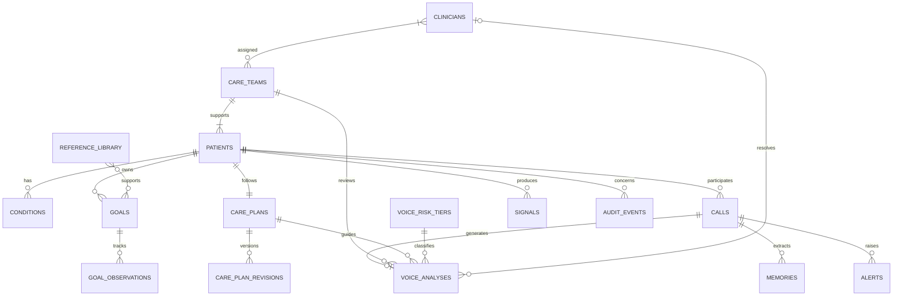

# Anchor data model

MongoDB is the local system of record. Relationships use stable domain IDs
(`patient_id`, `clinician_id`, `call_id`, and similar) rather than MongoDB
object IDs so records remain portable and auditable.

## Enforced invariants

- Each synthetic clinic patient belongs to `care-team-anchor-demo`, whose
  `clinician_ids` contains exactly two clinicians.
- Patient, clinician, care-team, call, goal, reference, risk-tier, and voice
  analysis domain IDs are uniquely indexed.
- One active care-plan document is stored per patient for fast reads. Every
  publish also appends an immutable `(patient_id, version)` revision.
- Goal observations retain their event time and source. A goal's
  `miss_threshold` is evaluated inside its own `tracking_window_days`.
- A repeated goal miss opens one deduplicated Tier 2 pattern alert. Direct
  safety signals remain Tier 3 escalations.
- Each completed call produces at most one voice analysis linked to the
  patient, care team, plan version, and risk tier.
- Reference entries are ID-addressable, categorized, clinician-reviewed, and
  surfaced only when their keywords are relevant.

All repository fixtures are synthetic. This model is evidence for the demo;
it is not a substitute for a production clinical governance, retention, or
authorization design.
