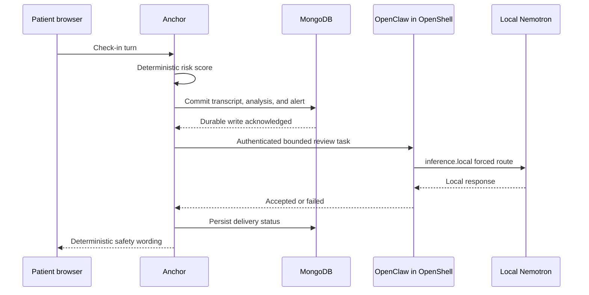

# Anchor system architecture

This is the canonical system diagram and explainer for Anchor's NVIDIA GB10
proof of concept. It defines the running components, trust and data boundaries,
safety-handoff ordering, and verification evidence. Operator steps live in
[GB10-RUNBOOK.md](GB10-RUNBOOK.md) and [OPENSHLL.md](OPENSHLL.md); the persisted
schema lives in [DATA-MODEL.md](DATA-MODEL.md).

## System diagram

```mermaid
flowchart LR
    browser[Browser<br/>clinician, patient, or /goal]
    cf[Optional Cloudflare tunnel<br/>access-code gate]

    subgraph gb10[Dell Pro Max GB10]
        subgraph compose[Anchor Compose boundary]
            api[Anchor FastAPI<br/>workflow + deterministic safety]
            mongo[(MongoDB 8<br/>durable system of record)]
            csm[Sesame CSM-1B<br/>CUDA BF16 voice]
            whisper[Whisper tiny.en<br/>CUDA microphone STT]
            goal[/goal<br/>private live telemetry]
        end
        subgraph models[Private model boundary]
            vllm[NVIDIA vLLM<br/>Nemotron 30B NVFP4]
        end
        subgraph sandbox[NVIDIA OpenShell boundary]
            claw[OpenClaw<br/>bounded review task]
            route[inference.local<br/>forced route]
        end
        gpu[nvidia-smi / CUDA<br/>GB10 counters]
    end

    browser -->|HTTPS when shared| cf -->|Anchor HTTP only| api
    browser -->|loopback in local mode| api
    api -->|plans, calls, alerts, audit| mongo
    api -->|OpenAI-compatible prompt| vllm
    api -->|text + consented enrollment| csm
    api -->|mono PCM WAV| whisper
    api -->|authenticated /hooks/wake| claw
    claw --> route --> vllm
    api --> goal
    vllm --> goal
    csm --> goal
    whisper --> goal
    gpu --> goal
    goal -->|one-second SSE| browser
```

Cloudflare is optional transport for a staffed demonstration; it is never in
the inference path. Nemotron, CSM, MongoDB, and OpenClaw have no public route.
The application is the only component exposed through the tunnel, and private
APIs require the access-code session when shared mode is enabled.

## Responsibilities

| Component | Owns | Explicitly does not own |
| --- | --- | --- |
| Anchor FastAPI | Workflow, deterministic risk scoring, consent checks, prompt assembly, audit writes, UI/API access | Durable model memory or autonomous treatment decisions |
| MongoDB 8 | Patients, plans/revisions, signals, calls, transcripts, memories, alerts, delivery results, audit | Model execution or agent capabilities |
| Nemotron on NVIDIA vLLM | Local conversational text from the bounded prompt | Safety classification, persistence, or care-plan authority |
| Sesame CSM-1B | Local catalog and consented personalized synthesis | Consent decisions or patient records |
| Whisper tiny.en | Local microphone transcription with in-memory audio | Raw-audio retention or clinical interpretation |
| OpenClaw in OpenShell | Narrow clinician-review handoff after a durable alert | Patient contact, plan edits, shell/browser access, or record custody |
| `/goal` telemetry | Masked clients, requests, active work, latency, and GB10 counters | Clinical decisions or a historical telemetry store |

## Durable safety and agent handoff

MongoDB is the system of record; the agent sandbox is disposable compute. The
ordering is a correctness property:



If the sandbox fails, the alert remains and delivery is recorded as `failed`
or `not-configured`. Patient speech never claims a clinician was notified.
Recreating OpenClaw loses no clinical state because tasks rebuild from MongoDB.

## Retrieval changes behavior

Before each call, Anchor reads the active clinician plan, current signals, and
earlier-call facts. Those records constrain the next prompt and safety response:
the greeting names the active plan, a later call may use a stored fact, and
concerning turns offer only allowed options. Publishing a plan creates an
immutable revision and changes the next call; the model cannot publish a plan.

## Locality and trust boundaries

- Model and voice inference execute on the GB10; no remote LLM or speech API is
  configured.
- OpenShell provides the private namespace, sandbox identity, policy, and forced
  `inference.local` route to Nemotron.
- OpenClaw loads only `memory-core`, uses the `minimal` tool profile with an
  empty allowlist, and rejects caller-selected session keys.
- Model weights, credentials, recordings, voice enrollment, and databases stay
  outside Git.
- Shared mode is synthetic-data demo infrastructure, not a production clinical
  security boundary.

## Live architecture and GB10 operations

`/goal` has separate Architecture and Performance tabs. Browsers send heartbeats
with ephemeral masked IDs. A private server-sent-event snapshot emits every
second with connected clients, request volume, bounded trace summaries, and
active/completed Nemotron, CSM, and Whisper
work, latency, readiness, and GPU utilization, memory, temperature, power, and
clocks from `nvidia-smi`. GPU sampling is cached across viewers, and clinical
payloads are not copied into telemetry.

The canonical node and edge IDs live in
`app/careline/architecture-topology.json`; the Architecture tab and trace
instrumentation consume that same manifest. A call receives an ephemeral
16-character trace ID. Safe spans cover context reads, durable call and alert
writes, Nemotron generation, Whisper transcription, CSM synthesis, the
OpenClaw wake, the configured OpenShell local route, and persisted delivery
state. The buffer retains at most 40 in-process traces and is lost on
application restart. Full detail is fetched only after selecting a trace.

Trace metadata permits only coarse collection, acknowledgement, delivery,
route, ordering, and machine-sample fields. It excludes names, patient and call
IDs, transcript or plan text, alert reasons, facts, tokens, credential-bearing
URLs, and private paths. The forced-route span proves the configured
`inference.local` policy and hook delivery state; it does not claim a
successful agent inference without runtime evidence. GPU values are
timestamp-correlated whole-machine samples, not exclusive per-request
attribution.

## Deployment and worktrees

All worktrees share one GPU, MongoDB volume, model server, and port set. The
canonical Compose project owns them. A worktree builds a uniquely tagged app
image and recreates only `digital-twin` with `--no-deps`; it must not start a
parallel inference or database stack.

## Agent's Last Exam

| Exam | Pass condition |
| --- | --- |
| Sandbox amnesia | Recreating OpenClaw loses no plans, facts, alerts, or audit evidence |
| Retrieval counterfactual | A stored fact affects only the retrieved run and is not invented in the control |
| Plan mutation | A new plan changes the next allowed options without model-authored treatment |
| Business continuity | App/agent restart with retained MongoDB preserves clinic state |
| Capability boundary | Patient contact, plan edit, browser, and shell requests remain unavailable |
| Delivery failure | Alert commits first, delivery becomes `failed`, and speech makes no notification claim |
| Safety escalation | Labeled low/high/crisis transcripts produce expected deterministic results |
| Locality | OpenShell/vLLM evidence shows model traffic stays on the private GB10 route |
| Voice proof | Consented calls produce local 24 kHz WAVs; missing consent is rejected |
| Public boundary | Anonymous private APIs fail and raw model/agent ports remain private |

```bash
CARELINE_BASE_URL=http://127.0.0.1:8100 python3 scripts/verify-nvidia.py
```

Production additionally requires identity/role controls, encryption, tenant
isolation, retention/deletion policy, backups, consent revocation, access audit,
and clinical validation. This POC uses synthetic data and claims no efficacy.
