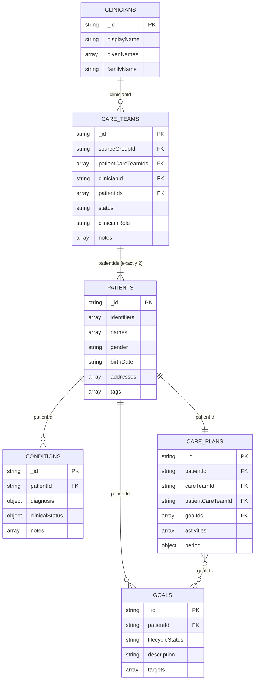

# MongoDB document model

Arrays and value objects that are owned by a single document are embedded. Shared entities and independently queried clinical resources use string references based on their FHIR IDs.

The `careTeams` collection deliberately stays at the five-team operational grain. Each document combines one source FHIR `Group` (`sourceGroupId`) with the two patient-scoped FHIR `CareTeam` resources listed in `patientCareTeamIds`. A care plan stores both the operational `careTeamId` and its exact FHIR `patientCareTeamId`.
