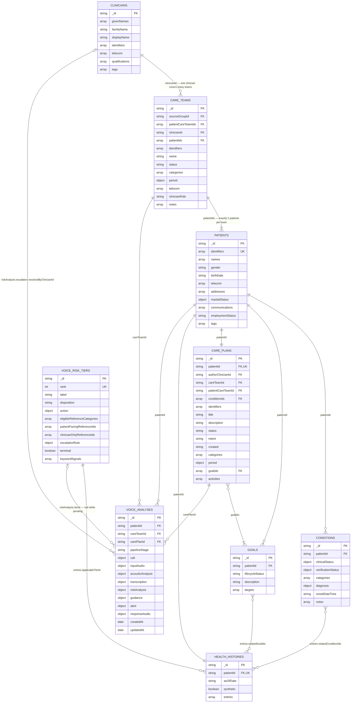
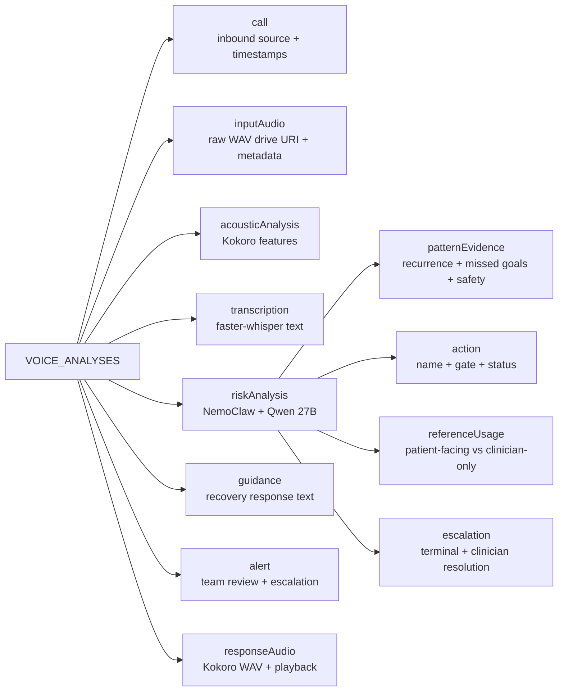

# Anchor FHIR MongoDB — Team Lead ERD

## Embedded voice-analysis structure

## Cardinality and enforcement notes

| Rule | Enforcement |
|---|---|
| Five care teams total | Seed validation and tests |
| FHIR patient-scoped CareTeams | Each MongoDB team projects two patient CareTeams identified by `patientCareTeamIds` |
| Two unique patients per team | `careTeams` JSON Schema uses `minItems: 2`, `maxItems: 2`, and `uniqueItems: true` |
| One team per patient | Unique multikey index on `careTeams.patientIds` |
| One clinician per team | Required scalar `careTeams.clinicianId` |
| One clinician may cover many teams | Non-unique index on `careTeams.clinicianId` |
| One care plan per patient | Unique index on `carePlans.patientId` |
| One health history per patient | Unique index on `healthHistories.patientId` |
| Lifestyle history remains non-diagnostic | Entries link back to authoritative FHIR condition and goal IDs |
| Tier 1 is ungated | `voiceRiskTiers/tier-1-mild` configuration and integration tests |
| Tier 2 is OpenShell-gated | `voiceRiskTiers/tier-2-moderate` configuration and integration tests |
| Tier 3 is always-open and terminal | `voiceRiskTiers/tier-3-at-risk` configuration and clinician-resolution tests |
| MongoDB references exist | Generator and integration tests; MongoDB itself does not enforce foreign keys |

## Review decisions

1. Patient identifiers remain FHIR string IDs instead of MongoDB `ObjectId` values to preserve interoperability.
2. Reusable clinical resources are separate collections; fields owned by one record are embedded subdocuments.
3. Each voice interaction is an append-oriented document referencing the patient, current care team, care plan, and selected risk-tier policy.
4. Keyword lists are review signals only. NemoClaw/Qwen performs the classification using context, recurrence, ambiguity, and safety evidence.
5. Tier 3 cannot self-resolve; clinician identity and resolution timestamps are stored in `riskAnalysis.escalation`.
6. Names, addresses, phone numbers, email addresses, team operations, and clinician credentials are deterministic synthetic demo values; none should be treated as real identity or contact data.
7. The five MongoDB care-team documents are operational projections. In source FHIR, five Groups define the rosters and ten patient-scoped CareTeams satisfy the one-patient CareTeam subject model.
