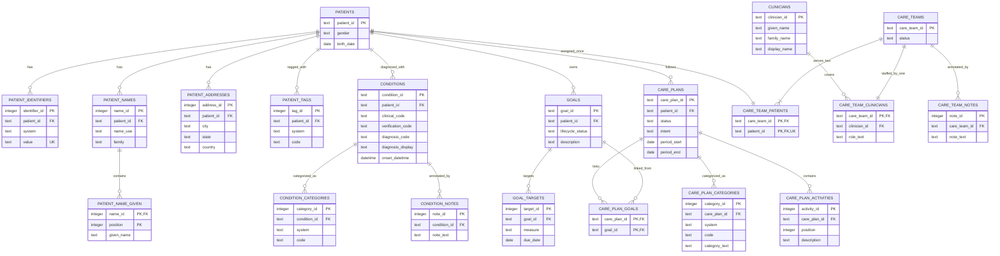

# Normalized FHIR Data ERD

```mermaid
erDiagram
    PATIENTS ||--o{ PATIENT_IDENTIFIERS : has
    PATIENTS ||--o{ PATIENT_NAMES : has
    PATIENT_NAMES ||--o{ PATIENT_NAME_GIVEN : contains
    PATIENTS ||--o{ PATIENT_ADDRESSES : has
    PATIENTS ||--o{ PATIENT_TAGS : tagged_with
    PATIENTS ||--o{ CONDITIONS : diagnosed_with
    CONDITIONS ||--o{ CONDITION_CATEGORIES : categorized_as
    CONDITIONS ||--o{ CONDITION_NOTES : annotated_by
    PATIENTS ||--o{ GOALS : owns
    GOALS ||--o{ GOAL_TARGETS : targets
    PATIENTS ||--o{ CARE_PLANS : follows
    CARE_PLANS ||--o{ CARE_PLAN_CATEGORIES : categorized_as
    CARE_PLANS ||--o{ CARE_PLAN_ACTIVITIES : contains
    CARE_PLANS ||--o{ CARE_PLAN_GOALS : links
    GOALS ||--o{ CARE_PLAN_GOALS : linked_from
    PATIENTS ||--|| CARE_TEAM_PATIENTS : assigned_once
    CARE_TEAMS ||--|{ CARE_TEAM_PATIENTS : serves_two
    CLINICIANS ||--o{ CARE_TEAM_CLINICIANS : covers
    CARE_TEAMS ||--|| CARE_TEAM_CLINICIANS : staffed_by_one
    CARE_TEAMS ||--o{ CARE_TEAM_NOTES : annotated_by

    PATIENTS {
        text patient_id PK
        text gender
        date birth_date
    }
    PATIENT_IDENTIFIERS {
        integer identifier_id PK
        text patient_id FK
        text system
        text value UK
    }
    PATIENT_NAMES {
        integer name_id PK
        text patient_id FK
        text name_use
        text family
    }
    PATIENT_NAME_GIVEN {
        integer name_id PK,FK
        integer position PK
        text given_name
    }
    PATIENT_ADDRESSES {
        integer address_id PK
        text patient_id FK
        text city
        text state
        text country
    }
    PATIENT_TAGS {
        integer tag_id PK
        text patient_id FK
        text system
        text code
    }
    CONDITIONS {
        text condition_id PK
        text patient_id FK
        text clinical_code
        text verification_code
        text diagnosis_code
        text diagnosis_display
        datetime onset_datetime
    }
    CONDITION_CATEGORIES {
        integer category_id PK
        text condition_id FK
        text system
        text code
    }
    CONDITION_NOTES {
        integer note_id PK
        text condition_id FK
        text note_text
    }
    GOALS {
        text goal_id PK
        text patient_id FK
        text lifecycle_status
        text description
    }
    GOAL_TARGETS {
        integer target_id PK
        text goal_id FK
        text measure
        date due_date
    }
    CARE_PLANS {
        text care_plan_id PK
        text patient_id FK
        text status
        text intent
        date period_start
        date period_end
    }
    CARE_PLAN_CATEGORIES {
        integer category_id PK
        text care_plan_id FK
        text system
        text code
        text category_text
    }
    CARE_PLAN_GOALS {
        text care_plan_id PK,FK
        text goal_id PK,FK
    }
    CARE_PLAN_ACTIVITIES {
        integer activity_id PK
        text care_plan_id FK
        integer position
        text description
    }
    CARE_TEAMS {
        text care_team_id PK
        text status
    }
    CARE_TEAM_PATIENTS {
        text care_team_id PK,FK
        text patient_id PK,FK,UK
    }
    CLINICIANS {
        text clinician_id PK
        text given_name
        text family_name
        text display_name
    }
    CARE_TEAM_CLINICIANS {
        text care_team_id PK,FK
        text clinician_id FK
        text role_text
    }
    CARE_TEAM_NOTES {
        integer note_id PK
        text care_team_id FK
        text note_text
    }
```
