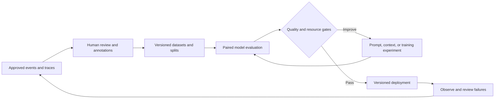

# Phase two: evaluation-driven development

Anchor will compare the existing Nemotron workload with Bonsai candidates on the same GB10. The objective is to reduce the whole application's memory footprint while preserving measured care-operations behavior. Any freed capacity must support a demonstrated additional workload, such as producing a clinician-reviewed activity summary. No model comparison or clinical validation is claimed by this plan.

Phase one proves the existing application, local inference, persistence, voice, and WebSocket messaging. Phase two extends that architecture with repeatable evaluation and evidence. The existing deterministic safety checks, clinician-authored plan, consent boundary, and human authority remain release requirements. See [system architecture](../SYSTEM-ARCHITECTURE.md), [data model](../DATA-MODEL.md), and [WebSocket messaging](websocket-messaging.md).

## Canonical workflow and Anchor's lifecycle

MLflow's [official end-to-end guide](https://mlflow.org/docs/latest/genai/datasets/end-to-end-workflow/) documents six steps: build and trace the application, capture traces, add expectations, create an evaluation dataset, evaluate, and iterate. The four stages below are Anchor's organizing structure around that documented workflow. MLflow does not define all model training as reinforcement learning.

| Anchor stage | Work and evidence | MLflow mapping |
| --- | --- | --- |
| Raw data to annotations | Collect approved events, database snapshots, conversations, and signals. Review failures and attach expected behavior, labels, and provenance. | Traces, expectations, feedback, evaluation datasets. |
| Optimization and training | Compare unchanged models first. Apply a justified prompt, retrieval, or model change. Evaluate on separate development and held-out data. | Evaluation runs, scorers, parameters, artifacts, and versioned model/application references. |
| Deployment | Promote an evaluated application/model pair with a reproducible manifest and rollback procedure. | Link deployment evidence to the passing evaluation run and exact release revision. |
| Observation and improvement | Sample deployed traces, measure operational performance, review errors, and add approved regressions to the next dataset release. | Trace/session monitoring, feedback, and repeated offline evaluation. |



The official guide requires a SQL-backed tracking server and specifies `mlflow>=3.4`. FileStore is insufficient for Evaluation Datasets. Pin a tested client/server pair after checking the existing server; do not upgrade a shared server blindly. Newer documentation features may require newer releases than the guide's minimum. Keep MLflow outside the care-serving container. The current command recorder tracks process execution; it does not yet establish complete application trace-to-dataset lineage.

## Current setup status

The existing GB10 server runs MLflow 3.16.0 with a SQLite backend and serves on loopback port 5210. The deployment experiment is `Anchor NVIDIA GB10` (13), with parent deployment run `0a1bfc3ae9ca4bc989f2e49b98b62a3f`. Phase-two setup created `Anchor Phase Two Evaluation` (14) and four empty datasets: `anchor-phase-two-candidates`, `anchor-phase-two-development`, `anchor-phase-two-holdout`, and `anchor-phase-two-production-replay`. Dataset creation was verified against the installed API.

These datasets have no reviewed annotations or evaluation results. The candidate pool is an intake dataset, not a model-training split. It now contains one observed synthetic call, marked unreviewed, from the live WebSocket verification. The other three datasets remain empty. Add explicit training and judge-calibration datasets when those workstreams require them.

Baseline startup and functional verification passed on September 22. The full
workload run is `52ac3bab3d374ec4937267cdf6e11906`, and the WebSocket reply,
reconnection, and transcript readback run is `fce23d52566a4d34be525de34adbc0cf`.
The saved summary exposed unsupported patient-action claims, tracked in
[issue #24](https://github.com/ChaiWithJai/anchor-nvidia-gb10/issues/24) and
discovery run `dd60da77baec4364934b6438d9fd3da8` in experiment 14. Functional
smoke tests establish a running workload; they do not establish clinical
quality or complete the phase-two release gates.

Rerun the idempotent setup on the GB10 using its existing MLflow environment:

```bash
MLFLOW_TRACKING_URI=http://127.0.0.1:5210 python scripts/bootstrap-phase-two.py
```

The existing Mac tunnel exposes the same server on loopback port 5810 while the tunnel is active. The [bootstrap script](../scripts/bootstrap-phase-two.py) creates missing datasets without inventing examples or labels.

## Scope and scientific claims

The baseline is `nvidia/NVIDIA-Nemotron-3-Nano-30B-A3B-NVFP4`, as configured in the repository. Pin the downloaded revision, content hashes, runtime image, and actual launch flags before measuring it. The first proposed candidate is the user-requested Ternary Bonsai 2 27B; confirm its exact public model identifier, checkpoint, license, architecture, and compatible GB10 runtime before adding a model row. Other family members become separate candidate rows with the same evidence requirements.

Preserved capability after quantization is a hypothesis evaluated per task and slice. Passing Anchor's test set does not establish universal losslessness. A model-to-model comparison measures complete model/runtime combinations, since Nemotron and Bonsai differ in more than precision. To isolate quantization effects, compare compatible representations of the same checkpoint, where available. Report missing controls explicitly.

| Intervention | Meaning | Prerequisite and measurement |
| --- | --- | --- |
| Prompt or retrieval change | Change instructions or supplied context without changing weights. | Trace the changed component and rerun task and safety evaluations. |
| Quantization | Reduce the precision or representation cost of weights and possibly activations. | Verify runtime support; measure quality, peak memory, latency, and throughput. |
| Pruning | Remove weights, channels, layers, or other structure. | Specify the method and recovery procedure. Sparsity alone does not guarantee a smaller allocation or faster kernels. |
| Supervised fine-tuning | Update weights using reviewed input/target examples. | Separate training, development, and test groups; record optimizer, adapters, and parent checkpoint. |
| Distillation | Train a student from a teacher's outputs or other signals. | Record teacher revision, generation settings, usage rights, filtering, and human checks. Teacher errors are not ground truth. |
| Preference optimization or RL | Optimize from comparisons or reward signals. Actual RL also requires a policy optimization procedure and rollout/reward design. | Validate preferences or rewards, monitor reward exploitation, and rerun independent safety tests. Logging feedback alone is not RL. |

Quantization, pruning, distillation, and fine-tuning are candidate experimental branches, not a mandatory sequence. Begin with an unchanged Bonsai candidate. Add weight training only when error analysis supports it and the checkpoint/runtime can train or load the resulting artifact. MLflow records training evidence; an external training framework performs the optimization. Local model use may remove a per-token vendor charge, but generation, annotation, hardware, electricity, engineering, and storage still have costs.

## Dataset construction and annotation

Start with synthetic, non-identifying fixtures and clinician-authored expected behavior. Use a snapshot of the application's documented schema and preserve input order, context, and prior turns. Keep voice enrollment assets and private transcripts out of the repository and public issue.

If representative approved traces exist, inventory them first and sample across workflow and failure slices. Otherwise, propose approximately 20 scenario combinations for domain review before generating natural-language inputs. Initial dimensions are workflow, risk/ambiguity, and context condition. Examples include a routine check-in with complete context, conflicting sleep reports, a missing plan, refusal of consent, a crisis signal, a stale memory, and an interrupted session. A first discovery batch of roughly 100 traces is a working target, not a statistical adequacy claim or clinical validation sample size.

Reviewers first inspect complete conversations and write free-text failure observations. Cluster observations into failure categories, then define the rubric and structured labels. Capture reviewer identity or pseudonym, role, rubric version, timestamp, evidence span, uncertainty, and adjudication. Require a qualified clinical reviewer for expected clinical boundaries. Keep disagreements rather than silently overwriting them.

An expectation describes what should happen. Feedback describes how an observed output performed. Store both separately using MLflow's [expectations workflow](https://mlflow.org/docs/latest/genai/datasets/end-to-end-workflow/#step-3-add-ground-truth-expectations) and [feedback collection](https://mlflow.org/docs/latest/genai/assessments/feedback/). Record labels such as workflow, concern tier, escalation required, permitted action, forbidden action, grounding evidence, and review status. Candidate labels remain suggestions until accepted.

Split at the patient/session/scenario-family level before model or prompt optimization. Related paraphrases and teacher-generated descendants stay together. Maintain separate training, development, judge calibration, and held-out test sets. Deduplicate exact and near duplicates across splits. Production incidents added after a release enter a new dataset version, not a silent edit to a reported test set.

Use development and regression cases for repeated iteration. Reserve the final
holdout for a predeclared promotion decision and record every exposure. If
holdout failures guide another optimization, treat the exposed cases as
development evidence and establish a new independent holdout.

## Data and model lineage

Every published comparison needs an immutable exported dataset snapshot plus its digest, even if the MLflow dataset can subsequently be updated. Keep sensitive payloads in approved storage, with references and hashes in the evidence manifest.

| Object | Required lineage |
| --- | --- |
| Source record | Source system, schema version, synthetic/approved-data status, source record ID, event time, extraction revision, retention policy. |
| Trace | Source record IDs, application revision, call/session ID, parent/child spans, model and prompt identifiers, trace ID, error status. |
| Annotation | Trace/record ID, expectation or feedback, rubric version, annotator provenance, review/adjudication history. |
| Dataset release | MLflow dataset ID, exported snapshot URI and SHA-256, split algorithm and seed, group assignments, inclusion/exclusion decisions, source trace IDs. |
| Training or generation run | Parent checkpoint, teacher if any, input dataset digest, code/environment revisions, seed, settings, hardware, output hashes, license references. |
| Evaluation run | Candidate manifest, test dataset digest, scorer code and judge revision, decoding parameters, raw per-case results, resource samples, failures. |
| Deployment | Evaluated model/application manifest, evaluation run ID, deployment command run, configuration digest, release decision, rollback artifact. |
| Observed failure | Deployment ID, sanitized trace reference, reviewer finding, issue, and next dataset regression ID. |

For synthetic data, preserve the scenario tuple, generation prompt, generator checkpoint, sampling parameters, filtering decisions, and reviewed lineage. The generator and judge should not be treated as independent evidence when they share a model. Keep a human-reviewed test set outside the generation/optimization loop.

Use `Anchor Phase Two Evaluation` (experiment 14) for phase-two evaluation and retain `Anchor NVIDIA GB10` (experiment 13) for deployment continuity. Link cross-experiment evidence explicitly. Tag runs with `phase=2`, `workstream`, `candidate_id`, `dataset_digest`, `git_sha`, and `run_kind`. A comparison parent run should link baseline, candidates, resource measurements, and the decision report. Avoid placing private patient identifiers in tags. Store the complete manifest as an artifact rather than trying to fit every field into tags.

## Evaluation design

Evaluate through the existing application handler. Use the WebSocket route for end-to-end ambient messaging cases and the same internal handler for repeatable offline cases. Model-only microbenchmarks are supplementary. An in-process trace buffer lost on restart cannot serve as the durable evaluation archive.

Measure task behavior and deterministic behavior separately. A deterministic crisis response cannot demonstrate that the model generated safer language. Report the fraction of turns that bypassed model generation, and verify that the full application persisted the alert before handoff. Test stored context with a retrieval counterfactual that removes the relevant fact.

| Area | Required checks |
| --- | --- |
| Plan adherence and grounding | Supported facts, no invented instructions or memories, relevant response, explicit handling of missing or conflicting context. |
| Safety and authority | All critical fixtures enforce authored safety behavior, persist alerts, report actual handoff status, and preserve human control of care plans. |
| Memory and summaries | Faithful attribution, chronology, omission of unsupported facts, correct persistence, isolation between patients. |
| WebSocket workflow | Ordered turns, input bounds, malformed messages, reconnect without accidental replay, explicit end, transcript parity with HTTP, access and origin controls. |
| Voice workflow | Separate ASR errors, language-model errors, synthesis errors, and total turn latency. Keep voices and prompts fixed for the paired comparison. |
| Clinical operations extension | Produce a draft activity summary with source references and human review. Evaluate EHR mapping in a sandbox before proposing any writeback. |

Use code scorers for deterministic properties. Use human judgments and calibrated LLM judges for subjective properties. Before trusting an LLM judge, measure agreement and class-specific error rates against adjudicated human labels on a separate calibration set. Blind model identity during review and test order effects for pairwise judgments. Record judge failures and missing scores explicitly. No automated judge alone authorizes clinical deployment.

Run candidates sequentially on the same GB10 to avoid model residency contention. Pin the dataset, prompt, retrieval snapshot, output budget, and application revision. Log any model-specific template changes. Separate cold-start, warmed, and steady-state measurements. Record available host memory, model/process allocations, total resident workload, peak unified-memory pressure, swap, model load time, time to first token, tokens per second, p50/p95 end-to-end latency, completion rate, and wall power where a meter exists. GPU power alone is not whole-system energy.

Use paired per-case quality differences and report uncertainty at the session/group level. Predeclare the non-inferiority margin and sample size before examining candidate results. Select the margin with a clinical owner; do not infer it from a favorable run. Use several repeated runs where nondeterminism affects results, with fixed documented seeds where supported.

## Release gates

The gates below are proposed acceptance rules. Numeric performance budgets and the non-inferiority margin require an explicit decision record before a comparison can pass.

1. Phase one has a reachable workload, real model readiness, a complete synthetic WebSocket conversation, persisted transcript, and linked deployment/verification runs.
2. Dataset provenance, grouping, rubric, review status, and locked evaluation snapshot are complete. Unsupported or unreviewed expectations cannot become a release benchmark.
3. Every critical deterministic safety case passes. A single failure blocks candidate promotion and receives an issue with a trace.
4. The candidate meets the predeclared quality margin on the primary task and required slices. A small or inconclusive sample is reported as inconclusive.
5. The candidate fits the declared whole-stack memory budget, meets latency and reliability budgets, and provides repeatable measured headroom over baseline.
6. A co-resident clinical operations task completes within the same budgets. A theoretical free-memory estimate alone does not satisfy the capacity claim.
7. The release manifest, cost report, rollback rehearsal, and reviewer decision link to the exact evidence runs.

## Deployment and observation

Promote the tested image, model revision, prompts, retrieval schema, and configuration together. First use shadow or synthetic traffic with no EHR writes. Retain the verified Nemotron configuration for rollback, and rehearse recovery after a failed candidate start. Keep the existing care workflow available while optional evaluation infrastructure fails.

The [MLflow automatic evaluation guide](https://mlflow.org/docs/latest/genai/eval-monitor/automatic-evaluations/) describes judge execution on logged traces and sessions. Its current documented prerequisites include an AI Gateway endpoint, and its automatic path supports LLM judges rather than code scorers. Verify support in the installed server before enabling it. Start with explicit offline/scheduled evaluation if adding a gateway would complicate the baseline. Run deterministic checks in application tests or the evaluation runner. Apply judge sampling and resource budgets so monitoring does not consume the headroom being measured.

Track errors, latency, memory pressure, escalation/handoff failures, unsupported-content findings, reviewer corrections, and quality by workflow slice. Link multi-turn traces with session IDs. Record sampling rates and missing telemetry. Investigate drift through reviewed examples, then add regressions to the next dataset release. MLflow's [regression testing guide](https://mlflow.org/docs/latest/genai/eval-monitor/regression-testing/) connects behavior checks to CI; use features available in the pinned version rather than assuming the latest APIs exist locally.

## Work sequence and open decisions

Implement [phase-two issue #21](https://github.com/ChaiWithJai/anchor-nvidia-gb10/issues/21) after phase-one readiness. [Cost issue #22](https://github.com/ChaiWithJai/anchor-nvidia-gb10/issues/22) and its [scenario report](phase-two-cost-analysis.md) distinguish measured local cost from cloud scenarios and itemize operational requirements.

Before the first scored comparison, resolve the exact Bonsai artifact and compatible runtime, dataset owner and clinical reviewer, primary task and quality margin, workload volume and concurrency, retention policy, and memory/latency budgets. Before any patient-data or EHR deployment, separately establish the authorized data boundary, integration contract, and operational review. A local demo and synthetic benchmark do not establish HIPAA compliance.

Documentation verified against the linked official MLflow pages on 2026-09-22. The `/latest/` pages can change, so record the installed MLflow version and the source date with implementation evidence.
